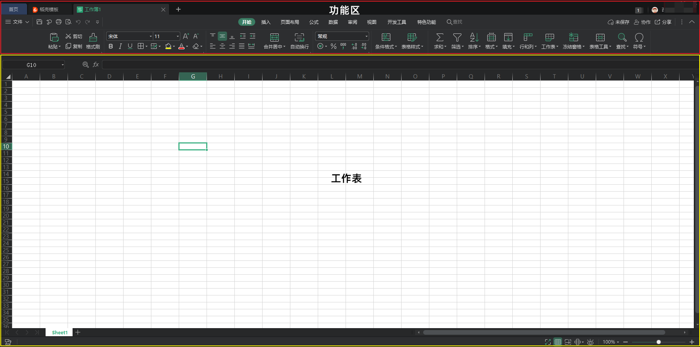

# 八年级上学期计算机资料

## 1 认识表格

表格，作为分析数据的重要工具。它清晰易懂，是相当适合我们学习的电脑技术

本章将先初识表格，在之后的几个章节中我们会讲到更高级的用法

### 1.1 软件界面

在 WPS 中，因为与 Office 一脉相承（抄袭），所以界面与 Office 的分区一样

WPS 分为 功能区 和 工作表 两个部分

**界面组成：**

|    名称    |              功能              |
| :--------: | :----------------------------: |
|  系统菜单  | 返回 WPS Office 主页的快捷方式 |
|  文件菜单  |          进行文件操作          |
| 快速工具栏 |    对文件进行快捷的常用操作    |
|   标题栏   |           显示文件名           |
| 管理工作区 |         WPS 云工作管理         |
| 设计功能区 | 包含多个选项卡，拥有大量的工具 |
|   编辑区   |   进行数据输入编辑的主要区域   |
| 视图控制区 |    对于表格大小进行缩放操作    |
|   状态栏   |        显示当前表格状态        |

### 1.2 工作表

#### 1.2.1 认识工作表

**定义：** 工作表是表格的主要编辑区域

**组成：**

|    名称    |                             功能                             |
| :--------: | :----------------------------------------------------------: |
|   名称框   |                    用于显示当前单元格名称                    |
|   编辑栏   |             输入和修改单元格数据，编辑公式和函数             |
|   单元格   |                        存放和显示数据                        |
| 列号和行号 |      列号和行号的组合即为单元格编号，列号在前，行号在后      |
| 工作表标签 | 一个工作簿可以包含多张工作表，标签可以帮助用户快速切换工作表 |

#### 1.2.2 重命名工作表

在实际应用中，我们可以根据实际需求对工作表进行命名。一般有以下两种方式

1. 双击需要重命名的工作表标签，直接输入新的工作表名称
    

2. 右键单击工作表标签，在快捷菜单中选择重命名命令
    

### 1.3 行和列

**行：** 横向的坐标。以数字从小到大排序

**列：** 纵向的坐标。以字母从左到右排序。如果超过 Z 则以 AA、AB 命名

### 1.4 单元格

**定义：** 工作表的行与列的交汇处叫做单元格

工作表由一个个单元格构成，单元格是存放数据的最小单元

每个单元格都有一个由行号和列表组成的专属名称

例如 B3 单元格。B3 表示该单元格位于第 B 列与第 3 行的交汇处

被选中的单元格被称为 “活动单元格”，在名称框中会显示出当前活动单元的名称（图中红色方框标识区域）

### 1.5 区域

**定义：** 由多个单元格组成的区域，每一个区域都可以用最左上角和最右下角的单元格名称表示

区域可以使用鼠标拖拽选择，在拖拽过程中会显示区域所包含的行数和列数

那么我们该如何表示区域呢？我们只需要知道区域左上角单元格和右下角单元格的名称就可以做出来

如上图，该区域的左上角单元格名称为 A1 ，右下角单元格名称为 C3

则该区域名称为：A1:C3

::: warning 注意
冒号要使用英文冒号，不能是中文
:::

## 2 表格数据获取

### 2.1 输入文本

在单元格中输入数据的方式通常有三种：选择单元格输入、双击单元格输入和在编辑栏输入

1. 选择单元格输入

先选择自己要修改的单元格，这里以 B3 单元格为例。之后直接用输入法输入内容即可

2. 双击单元格输入

先选择自己要修改的单元格，这里以 B3 单元格为例。之后用鼠标左键双击呈现为可输入状态即可

3. 在编辑栏中输入

先选择自己要修改的单元格，这里以 B3 单元格为例。之后在编辑栏中输入文本即可

### 2.2 输入日期和时间

WPS 中规定了多种数据类型。输入的数字默认以 “常规” 方式显示，如果需要指定显示为何种格式可以通过以下方式更改

1. 日期

选中需要修改格式的单元格，输入数据（我以日期格式的数据为例）。右键在快捷菜单中选择设置单元格格式选项

在 数字 选项卡中，在分类中选择日期选项（根据需求选择），点击确定

2. 时间

选中需要修改格式的单元格，输入数据（随便输入一个时间）。右键在快捷菜单中选择设置单元格格式选项

在 数字 选项卡中，在分类中选择时间选项（根据需求选择），点击确定

确定后单元格中的数字应该会被更改成这种样式，显示的时间格式取决于你选择的类型

### 2.3 
